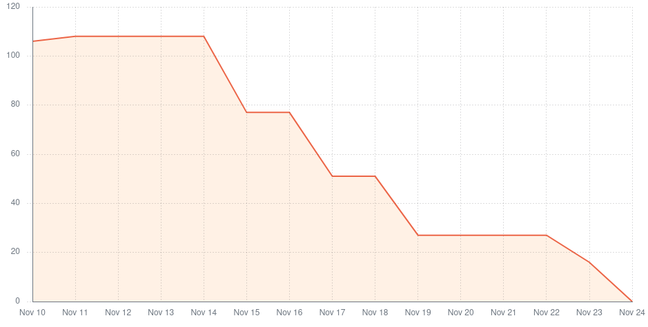

# Overall - Sprint 1 retrospective

## What went well?

- Ability to work in spite of lack of information/knowlegde. 
- Good communnication across teams and team members.
- Delivered a product increase with value to the client.
- The team now has a better knowledge of the technologies used and the increments needed for the next sprints.
- The product owner was happy about the presentation in the sprint review.

## What could have gone better?

- Since the project was started from scratch, there were a few tasks depending on others and that slowed down the development considerably. This lead to a not ideal work flow.
- User stories could have been better defined.
- The tasks were done too late and little time was left for reviews and iterations.
- There should have been more tests.

## What should we do differently?

- We wish we'd have more time for improvements during the code reviewal process. That should be an indicator to reduce the number of story points assigned in the next sprint planning.
- Improve technical standards (architecture, tests, styling, documentation, etc.).
- Standard interface styling across microservices, according to the mocks.

## Metrics

**Velocity**: 112 story points in two weeks (sprint).

The time per task (lead time) was aproximately 1 complete day, counting 3-4 hours for the review process before integration.

There were no integrations resulting in the failure of the main/develop pipeline environment, so the failure rate
was none.

There was only a single deployment to the main environment, at the end of the sprint. There were integrations to the
develop environment (Github branch) every time a user story was completed.

# Sprint 2 retrospective

## What went well?

- Better user story estimation as we have a better understanding of the project.
- More tests (variety and in number) even though there is room for improvement .
- More detailed reviews.
- Work method improved since the last sprint, namely better time management and planning.  

## What could have gone better?

- Kafka integration was not possible due to confluent package problems.
- Pull request and commit's sizes should be smaller to document in more detail the changes and to allow true reviews.
- Some documentation sections are missing.
- Some metrics are still missing in the microservices.

## What should we do differently?

- Although there was an improvement in testing, we still think there is room for improvement in both quantity and comprehensiveness of the tests.
- Improve documentation (architecture, tests, styling, documentation, etc.).
- Standard interface styling across microservices, according to the mocks.
- Give more detailed code reviews so as to improve the code quality.

## Metrics

**Velocity**: 183 story points in two weeks (sprint).

The time per task (lead time) was aproximately 1 complete day, counting 3-4 hours for the review process before integration.

There were no integrations resulting in the failure of the main/develop pipeline environment, so the failure rate
was none.

There was only a single deployment to the main environment, at the end of the sprint. There were integrations to the
develop environment (Github branch) every time a user story was completed.

# Sprint 3 retrospective

## What went well?

- High velocity. (Despite the overall velocity is lower than the previous Sprint, the change was expected because the 2nd sprint was done during the FEUP's week and we had more time for the project.)
- Kafka started working.
- Integration of all microservices in the base-app (highly requested by the PO).
- Pull request sizes decreased.

## What could have gone better?

- Better management of GitHub Action minutes available.
- Kafka payload initially requested by the PO changed after being done. Simplified version was asked in Sprint 3 demo.
- PO happiness meter (neutral face) due to not being deployed in production and design system inconsistency.

## What should we do differently?

- Have an external runner to avoid running out of actions minutes.
- Create general base-app script to set up all microservices.

## Action Points

### Continue
- Testing.
- Small pull requests.

### Start
- Start using external runners for the github actions.
- Start working on the design system.

### Stop
- Stop making decisions on the frontend design without consulting all the teams which will use some similar components.

## Metrics

**Velocity**: 108 story points in two weeks (sprint).

The change in the team's velocity was expected because the 2nd sprint was done during the FEUP's week and we had more time for the project.

The time per task (lead time) was aproximately 1 complete day, counting 3-4 hours for the review process before integration.

There were no integrations resulting in the failure of the main/develop pipeline environment, so the failure rate
was none.

There was only a single deployment to the main environment, at the end of the sprint. There were integrations to the
develop environment (Github branch) every time a user story was completed.
