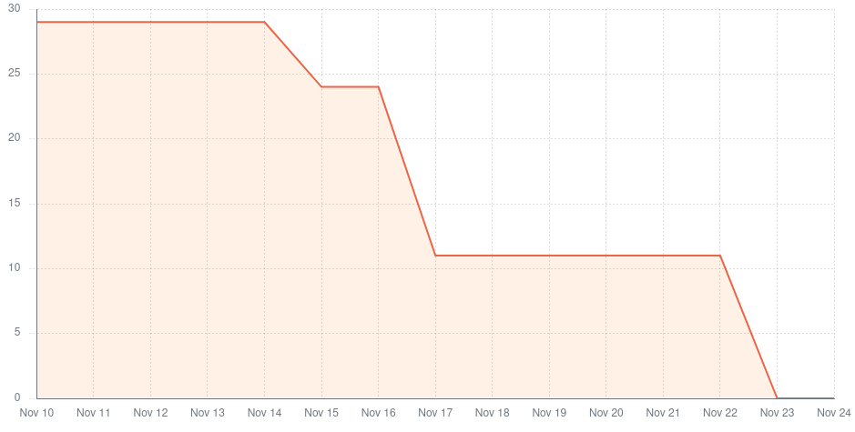

# Team 1 - Sprint 1 retrospective

## What went well?

- Planned issues were done and integrated.
- Delivered a product increase with value to the client.
- The team now has a better knowledge of the technologies used and the increments needed for the next sprints.
- The product owner was happy about the presentation in the sprint review.
- Good communnication across teams and team members.

## What could have gone better?

- The tasks were done too late and little time was left for reviews and iterations.
- There should have been more tests.
- The developed interfaces are not friendly for mobile environments. Responsiveness and architecture could be improved.
- Since the project was started from scratch, there were a few tasks depending on others and that slowed down the development considerably. This lead to a not ideal work flow.
- User stories could have been better defined.

## What should we do differently?

- We wish we'd have more time for improvements during the code reviewal process. That should be an indicator to reduce the number of story points assigned in the next sprint planning.
- We should start our tasks earlier and finish them with enough time for multiple reviews and changes.
- Integrate changes to the `develop` branch more often, so everyone can easily have the latest changes.
- Focus on a few complete and tested integrations instead of doing too many things in the same sprint (depth over breadth).
- Improve technical standards (architecture, tests, styling, documentation, etc.).
- Standard interface styling across microservices, according to the mocks.

## What still puzzles us?

- How to better distribute tasks during the sprint. Everyone has the same multiple courses at the same time, resulting in tasks being mostly done in a few days instead of evenly during the two weeks.
- There are still some doubts regarding technical details (e.g. providers, validations), as we are learning on the go.

## Metrics

**Velocity**: 36 story points in two weeks (sprint).

The time per task (lead time) was aproximately 1 complete day, counting 3-4 hours for the review process before integration.

There were no integrations resulting in the failure of the main/develop pipeline environment, so the failure rate
was none.

There was only a single deployment to the main environment, at the end of the sprint. There were integrations to the
develop environment (Github branch) every time a user story was completed.

# Sprint 2 retrospective

## What went well?

- Planned user stories were done and integrated.
- Delivered a product increase with value to the client.
- The sprint was finished in a timely manner.
- Some improvements and refactors were made.
- A lot more tests and code reviews were made.

## What could have gone better?

- The documentation is still lacking and should be more detailed.
- Some metrics are still missing.
- Changes weren't all integrated on the time of the demo with the PO.

## What should we do differently?

- Integrate to the `develop` branch more often with smaller changes. This was improved from last sprint but it still isn't great.
- Add more technical documentation and metrics to the project.
- Improve the consistency of the interface styling across all microservices.

## What still puzzles us?

- How Kafka is going to be integrated in our microservice.
- How each microservice's interface is going to be made consistent.
- What we'll use for static analysis, metrics and code coverage.

## Metrics

**Velocity**: 42 story points in two weeks (sprint).

The time per task (lead time) was aproximately 1 complete day, counting 3-4 hours for the review process before integration.

There were no integrations resulting in the failure of the main/develop pipeline environment, so the failure rate
was none.

There was only a single deployment to the main environment, at the end of the sprint. There were integrations to the
develop environment (Github branch) every time a user story was completed.

# Sprint 3 retrospective

## What went well?

- Planned user stories were done and integrated.
- Delivered a product increase with value to the client.
- The sprint was finished in a timely manner.
- Pull requests were smaller and easier to review.
- Code coverage is being calculated and shown in README.
- Creation of a styling guide for the interfaces.

## What could have gone better?

- Understimated the capabilities of the used pipeline, which lead to a failed deployment.
- Lack of people working in devops.
- Lack of documentation.

## What should we do differently?

- Allocate more people to devops.
- Focus on quality and documentation.
- Migrate to a more robust pipeline.

## What still puzzles us?

- How to improve the capabilities of the pipeline.
- What telemetries to add.

## Metrics

**Velocity**: 45 story points in two weeks (sprint).

The time per task (lead time) was aproximately 1 complete day, counting 3-4 hours for the review process before integration.

The pipeline was failing after the reach of the pipeline limit, so the failure rate was considerable.

There was only a single deployment to the main environment, at the end of the sprint. There were integrations to the
develop environment (Github branch) every time a user story was completed.

# Sprint 4 retrospective

## What went well?

- Design System was well integrated in Inbound.
- Planned user stories and work items were done and integrated.
- Static analysis, telemetry and self-hosted actions were added.
- The sprint was finished in a timely manner.
- Some people were allocated to devops.

## What could have gone better?

- The provided infraestructure was not enough for the project, pipeline was either lacking minutes or computational power.
- Deploys had some problems (weak infraestructure).
- The deployed server had a lot of limitations for this release.

## What should we do differently?

- Make a better plan about deploys, pipeline and other infraestructures.
- Plan how the login system should be integrated.

## What still puzzles us?

- How the login system will be integrated.
- How to improve the capabilities of the pipeline and deploy system.

## Action Points

### Continue
- Consistent pull requests and code reviews.
- Continue writing tests.
- Consistent design.
- Good communication.

### Start
- Start implementing login system.
- Deeply test the application.
- Start finding and fixing more bugs.
- Start performance testing and monitoring.
- Improve maintainability score.

### Stop
- Stop relying on inconsistent free services.
- Merging pull requests too close to the demo.

## Metrics

**Velocity**: 52 story points in two weeks (sprint).

The time per task (lead time) was aproximately 1 complete day, counting 3-4 hours for the review process before integration.

The pipeline was failing after the reach of the pipeline limit, so the failure rate was considerable.

There was only a single deployment to the main environment, at the end of the sprint. There were integrations to the
develop environment (Github branch) every time a user story was completed.

**Burndown chart**:

