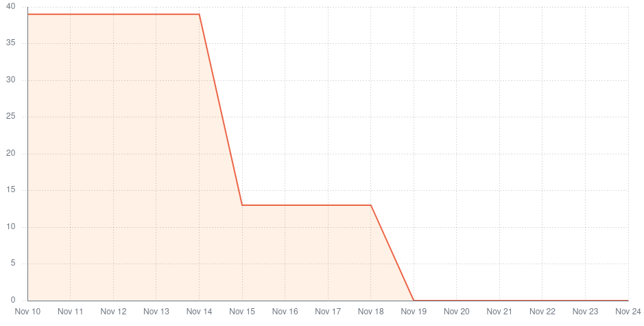

# Team 2 - Sprint 1 retrospective

## What went well?

The main objectives for this iteration were accomplished:
- Implementation of the product list page of the catalog
- Implementation of the feature to add a product

The team had already contributed heavily to the product backlog and still has plenty
of user stories ready to go to the next sprint on the catalog micro-service.

## What could have gone better?

We could not implement the feature to add a list of products by means of uploading a
.xlsx file due to the lateness of information on the format of the file by the PO.

## What should we do differently?

We should start working on the project in a more timely manner so
that the best possible results can be achieved.
This turns out to be very difficult to articulate with deliveries in other
curricular units of the course.

We should start doing some setup configurations in separate branches
and pull requests to update them in a more organic way in each
of the feature branches.

## What still puzzles us?

- How will we react to Kafka messages from the other micro-services?
- How will we inject the authentication from the base app?
- How will we enhance test-driven development?
- How will we test the database controller?

## Metrics

**Velocity**: 21 story points in two weeks (sprint).

The time per task (lead time) was approximately 1 complete day, counting 3-4 hours for the review process before integration.

There were no integrations resulting in the failure of the main/develop pipeline environment, so the failure rate
was none.

There was only a single deployment to the main environment, at the end of the sprint. There were integrations to the
develop environment (Github branch) every time a user story was completed.

# Sprint 2 retrospective

## What went well?

The main objectives for this iteration were accomplished:
- Refactor from Products to Products/Variants both on the FE and BE as requested by the PO
- Detailed page of variant
- Finished the import variants by .xlsx
- Archive variant
- Improved error validation and reporting of the add product/variant form
- Edit variant/product (in collaboration with [Rui Alves](../../../factsheets/Rui_Alves.md))

This was an excellent improvement to the product which the PO appreciated.
Our work method improved since the last sprint, namely better time management and thorough code reviews.

## What could have gone better?

Although there was an improvement in testing, we still think there is room for improvement in both quantity and comprehensiveness of the tests.

We made some refactors late on the sprint which caused some issues with the integration of the code. This could have been avoided if we had done the refactors earlier.

Since the microservices are not yet integrated, the catalog doesn't have access to the user's role and permissions which prevents us from restricting and/or customizing some features.

## What should we do differently?

We should focus on testing more thoroughly and more often.

We should start collecting metrics on the test coverage and telemetry of the application.

## What still puzzles us?

- How will we react to Kafka messages from the other micro-services?
- How will we inject the authentication from the base app?
- How will we test the backend and frontend in an integrated fashion given that they are not coupled?

## Metrics

**Velocity**: 81 story points in two weeks (sprint).

The time per task (lead time) was approximately 1 complete day, counting 3-4 hours for the review process before integration.

There were no integrations resulting in the failure of the main/develop pipeline environment, so the failure rate was none.

There was only a single deployment to the main environment, at the end of the sprint. There were integrations to the develop environment (Github branch) every time a user story was completed.

# Sprint 3 retrospective

## What went well?

The main objectives for this iteration were accomplished:
- Paginated the catalog;
- Added the search functionality to the catalog;
- Added the Brand filter to the catalog;
- Refactored the catalog to separate the concepts of Brand and Supplier.

This was an excellent improvement to the product which the PO appreciated.

## What could have gone better?

- We could have done more work into making the catalog consistent with the other microservices;
- We could be more careful with the actions we use and the retries that they do which cause valuable actions' time to be wasted.

## What should we do differently?

- We should increase the test code coverage;
- We should start collecting metrics on telemetry of the application.

## What still puzzles us?

- How will we inject the authentication from the base app?
- How will we test the backend and frontend in an integrated fashion given that they are not coupled?

## Action Points

### Continue
- Good code reviews;
- Testing (good code coverage).

### Start
- Start using external runners for the github actions;
- Start working on the design system.

### Stop
- Stop making decisions on the frontend design without consulting all the teams which will use some similar components.

## Metrics

**Velocity**: 39 story points in two weeks (sprint).

The change in the team's velocity was expected because the 2nd sprint was done during the FEUP's week and we had more time for the project.

The time per task (lead time) was approximately 1 complete day, counting 3-4 hours for the review process before integration.

There were no integrations resulting in the failure of the main/develop pipeline environment, so the failure rate was none.

There were two deployments to the main environment, at the end of the sprint. There were integrations to the develop environment (Github branch) every time a user story was completed.
