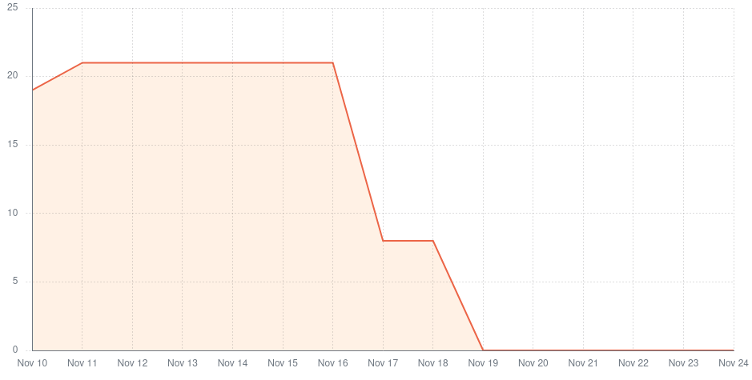

# Team 3 - Sprint 1 retrospective

## What went well?

The main objectives for this iteration were accomplished:

- Implementation of a mock login feature
- Implementation of the feature to toggle between microservices
- Implementation of the feature to cancel a purchase order

The team has pretty much wrapped up all user stories regarding the base app seeing as it was a simple job.
The communication in between teams allowed our job to be effective enough that we had stuff to show the PO, which was very happy with our job.

## What could have gone better?

We struggled to handle the multiple deadlines of the course which resulted in most of the work for Sprint 1 being done in a short period of time. We also struggled with having to learn the technology in this first sprint.
This time struggle lead to somewhat lackluster reviews and less unit tests than maybe should have existed.

## What should we do differently?

We should start working on the project sooner than we did in this sprint in order to achieve the best possible result, but this becomes quite difficult to articulate with the rest of the UC's deliveries.

We should become better at estimating the effort required for our user stories and recalculating our speed (being better at antecipating problems)

## What still puzzles us?

- How will we forward the authentication to the other microservices?

## Metrics

**Velocity**: 34 story points in two weeks (sprint).

The time per task (lead time) was approximately 1 complete day, counting 3-4 hours for the review process before integration.

There were no integrations resulting in the failure of the main/develop pipeline environment, so the failure rate
was none.

There was only a single deployment to the main environment, at the end of the sprint. There were integrations to the
develop environment (Github branch) every time a user story was completed.

# Sprint 2 retrospective

## What went well?

- Planned user stories were finished and merged to development branch.
- Delivered a product increase with value to the client.
- Code reviews were improved significantly.

## What could have gone better?

- Some metrics are still missing.
- Changes weren't all integrated on the time of the demo with the PO.
- Documentation missing (?)

## What should we do differently?

- Integrate to the `develop` branch more often with smaller changes.
- Commit more often and making less changes per commit.
- Add more technical documentation and metrics to the project.

## What still puzzles us?

- How Kafka is going to be integrated in our microservice.
- How each microservice's interface is going to be made consistent.
- What we'll use for static analysis, metrics and code coverage.

## Metrics

**Velocity**: 42 story points in two weeks (sprint).

The time per task (lead time) was aproximately 1 complete day, counting 3-4 hours for the review process before integration.

There were no integrations resulting in the failure of the main/develop pipeline environment, so the failure rate
was none.

There was only a single deployment to the main environment, at the end of the sprint. There were integrations to the
develop environment (Github branch) every time a user story was completed.

# Sprint 3 retrospective

## What went well?

- Planned user stories were finished and merged to development branch.
- Managed to merge development branch into main branch, producing a release for this sprint in a timely manner.
- Delivered a product increase with value to the client.
- Code reviews were improved significantly in comparison to the previous sprint.
- Changes were properly integrated before the demo with the PO.

## What could have gone better?

- Some metrics are still missing.
- General technical documentation is still missing.
- Merge to development branch more gradually throughout the sprint instead of doing it on the final days.

## What should we do differently?

- Integrate to the `develop` branch more often with smaller changes.
- Commit more often and making less changes per commit.
- Add more technical documentation and metrics to the project.

## What still puzzles us?

- What we're gonna use to implement login across all microservices

## Action Points

### Continue

- Good code reviews
- Good velocity
- Good unit testing

### Start

- Start using external runners for the github actions
- Start working on the design system.
- Start incorporating the design system components on our microservice frontend
- Start incorporating the base app login in the brand config microservice to display the app according to the different types of users.

### Stop

- Stop merging user stories to development branch on the last day of the sprint

## Metrics

**Velocity**: 53 story points in two weeks (sprint).

The time per task (lead time) was aproximately 1 complete day, counting 3-4 hours for the review process before integration.

There were no integrations resulting in the failure of the main/develop pipeline environment, so the failure rate
was none.

There was only a single deployment to the main environment, at the end of the sprint. There were integrations to the
develop environment (Github branch) every time a user story was completed or a bugfix needed to be patched on.
